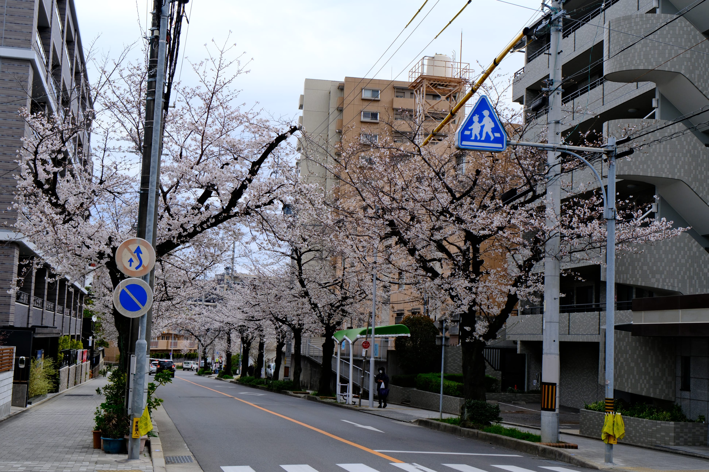
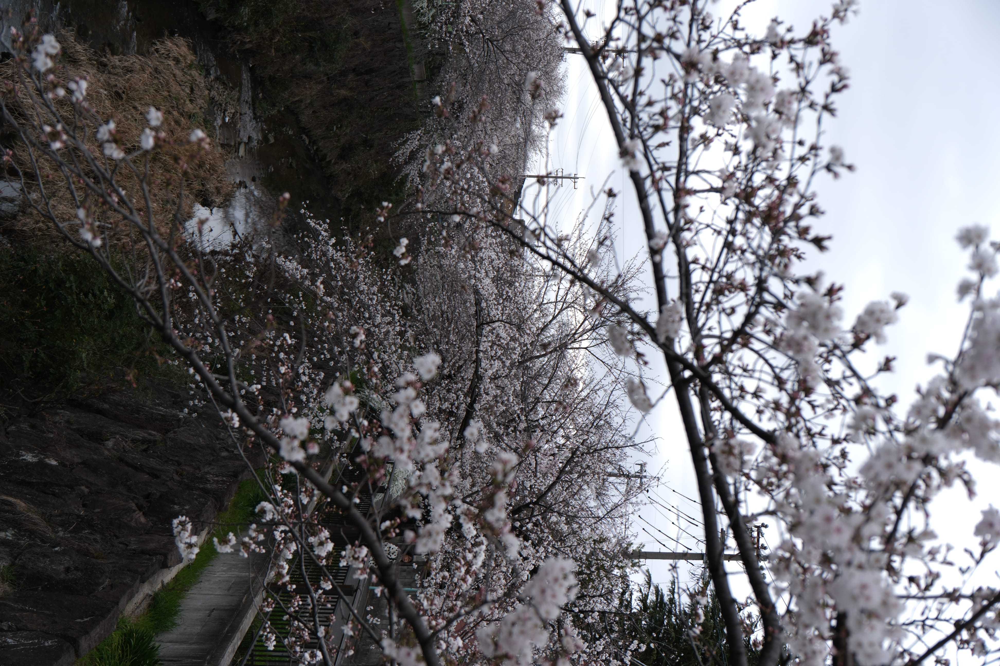
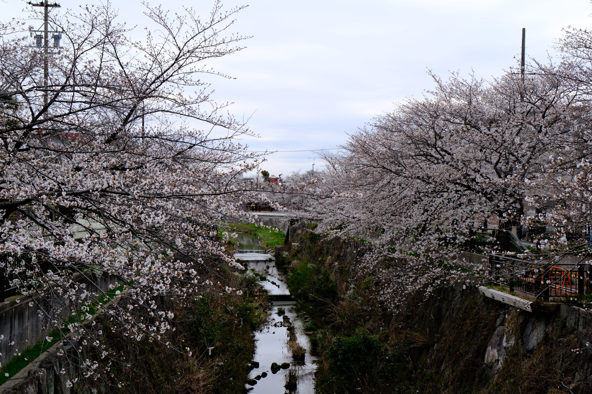
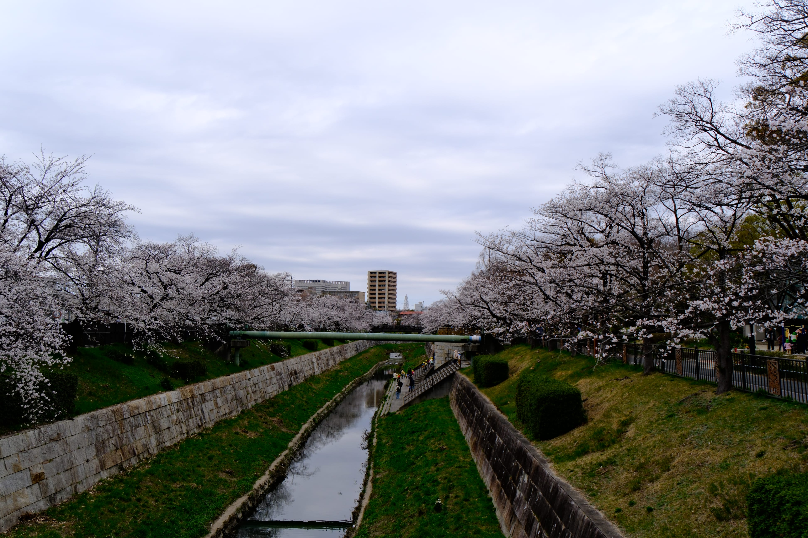
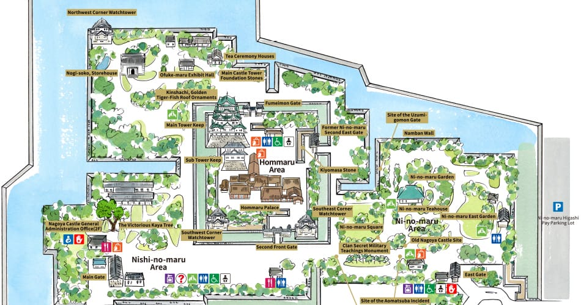

# <b>Finalmente piena fioritura</b>

Ho iniziato la giornata andando alla <b>Four Seasons Road of Yamazaki River</b>, è una zona  universitaria poco turistica di Nagoya, dove in questo periodo di fioritura è possibile fare una passeggiata lungo fiume e ammirare centinaia di ciliegi in fiore.

Appena usciti dalla stazione:

In circa 10 minuti si arriva a destinazione

 

 

 

Dopo un pranzo veloce, nel pomeriggio sono andato a vedere il castello di Nagoya.
Il costo del biglietto è 500yen e permette di vedere la zona di parco, l'esterno del castello e il palazzo Hommaru.
Questo palazzo è stato costruito nel 1615 e veniva usato principalmente come ufficio amministrativo. L'interno è decorato da murales e illustrazioni.

 

